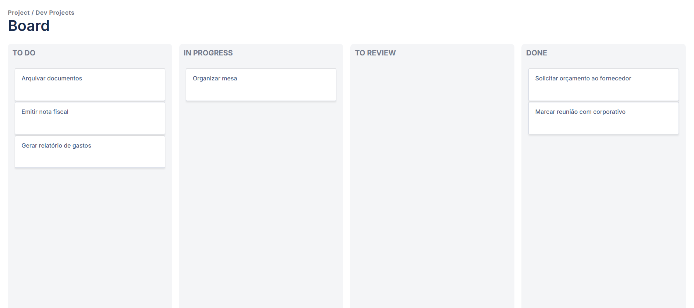

# Quadro-de-Tarefas(KANBAN)
Quadro de tarefas utilizando JavaScript, Html e Css

Quadro de tarefas utilizado por muitas empresas, e por diversas métodologias de projeto.

Projeto do Manual do Dev,
Replicado para desenvolvimento de habilidades de Programação!

Projeto totalmente didático e educacional
Créditos: Canal: https://www.youtube.com/@ManualdoDev
